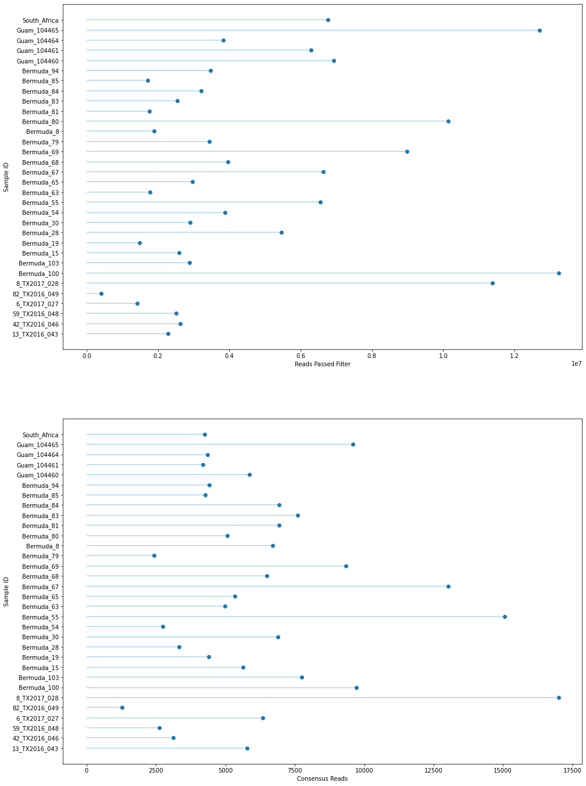

# Masked Reference Assembly (all samples) Report

## Parameters:

```python
------- ipyrad params file (v.0.9.62)-------------------------------------------
phys_both                      ## [0] [assembly_name]: Assembly name. Used to name output directories for assembly steps
/gpfs/ysm/scratch60/dunn/rb956/finalproject/ipyrad09 ## [1] [project_dir]: Project dir (made in curdir if not present)
Merged: phys_idx1, phys_idx3   ## [2] [raw_fastq_path]: Location of raw non-demultiplexed fastq files
Merged: phys_idx1, phys_idx3   ## [3] [barcodes_path]: Location of barcodes file
Merged: phys_idx1, phys_idx3   ## [4] [sorted_fastq_path]: Location of demultiplexed/sorted fastq files
reference                      ## [5] [assembly_method]: Assembly method (denovo, reference)
/gpfs/ysm/scratch60/dunn/rb956/finalproject/ipyrad09/reference/physalia_pilonPolished.hardMask.fa ## [6] [reference_sequence]: Location of reference sequence file
pairddrad                      ## [7] [datatype]: Datatype (see docs): rad, gbs, ddrad, etc.
CATG, AATT                     ## [8] [restriction_overhang]: Restriction overhang (cut1,) or (cut1, cut2)
5                              ## [9] [max_low_qual_bases]: Max low quality base calls (Q<20) in a read
30                             ## [10] [phred_Qscore_offset]: phred Q score offset (33 is default and very standard)
6                              ## [11] [mindepth_statistical]: Min depth for statistical base calling
6                              ## [12] [mindepth_majrule]: Min depth for majority-rule base calling
10000                          ## [13] [maxdepth]: Max cluster depth within samples
0.85                           ## [14] [clust_threshold]: Clustering threshold for de novo assembly
1                              ## [15] [max_barcode_mismatch]: Max number of allowable mismatches in barcodes
2                              ## [16] [filter_adapters]: Filter for adapters/primers (1 or 2=stricter)
35                             ## [17] [filter_min_trim_len]: Min length of reads after adapter trim
2                              ## [18] [max_alleles_consens]: Max alleles per site in consensus sequences
0.05                           ## [19] [max_Ns_consens]: Max N's (uncalled bases) in consensus
0.05                           ## [20] [max_Hs_consens]: Max Hs (heterozygotes) in consensus
4                              ## [21] [min_samples_locus]: Min # samples per locus for output
0.2                            ## [22] [max_SNPs_locus]: Max # SNPs per locus
5                              ## [23] [max_Indels_locus]: Max # of indels per locus
0.5                            ## [24] [max_shared_Hs_locus]: Max # heterozygous sites per locus
4, 0, 8, 0                     ## [25] [trim_reads]: Trim raw read edges (R1>, <R1, R2>, <R2) (see docs)
0, 0, 0, 0                     ## [26] [trim_loci]: Trim locus edges (see docs) (R1>, <R1, R2>, <R2)
p, s, l                        ## [27] [output_formats]: Output formats (see docs)
                               ## [28] [pop_assign_file]: Path to population assignment file
                               ## [29] [reference_as_filter]: Reads mapped to this reference are removed in step 3
```

## Results


```python
from IPython.display import display, Markdown
import numpy as np
import matplotlib.pyplot as plt
import pandas as pd
```

### Tables
Table 1: Reference-based Assembly Results


```python
assembly = pd.read_csv("assembly_both_stats.csv", header=0, index_col = 0)
assembly = assembly.drop(columns = ['state', 'reads_raw', 'refseq_unmapped_reads'])
display(Markdown(assembly.to_markdown()))
```


| sample        |   reads_passed_filter |   refseq_mapped_reads |   clusters_total |   clusters_hidepth |   hetero_est |   error_est |   reads_consens |   loci_in_assembly |
|:--------------|----------------------:|----------------------:|-----------------:|-------------------:|-------------:|------------:|----------------:|-------------------:|
| 13_TX2016_043 |           2.2767e+06  |      590406           |           203003 |              10849 |     0.015853 |    0.010342 |            5782 |               3895 |
| 42_TX2016_046 |           2.6215e+06  |      262858           |            99758 |               4305 |     0.012114 |    0.009876 |            3110 |               2236 |
| 59_TX2016_048 |           2.50358e+06 |      237785           |            93409 |               3752 |     0.010275 |    0.011022 |            2622 |               1893 |
| 6_TX2017_027  |           1.41032e+06 |      629930           |           216153 |              12053 |     0.016929 |    0.010515 |            6341 |               3964 |
| 82_TX2016_049 |      411433           |       90606           |            33984 |               1540 |     0.010552 |    0.00966  |            1282 |                907 |
| 8_TX2017_028  |           1.13714e+07 |           1.76268e+06 |           436346 |              38193 |     0.020348 |    0.010031 |           16997 |               8083 |
| Bermuda_100   |           1.32326e+07 |      779220           |           191361 |              13577 |     0.010553 |    0.007429 |            9722 |               6183 |
| Bermuda_103   |           2.88689e+06 |      719567           |           160256 |              11729 |     0.012236 |    0.007638 |            7757 |               5431 |
| Bermuda_15    |           2.58688e+06 |      457198           |           120439 |               8626 |     0.012143 |    0.00707  |            5641 |               3928 |
| Bermuda_19    |           1.48893e+06 |      593382           |           190964 |              10826 |     0.022148 |    0.010936 |            4390 |               2200 |
| Bermuda_28    |           5.46699e+06 |      324328           |           115132 |               5447 |     0.014018 |    0.009286 |            3339 |               2217 |
| Bermuda_30    |           2.90583e+06 |      670183           |           163859 |              11714 |     0.013441 |    0.00796  |            6880 |               4669 |
| Bermuda_54    |           3.88378e+06 |      290566           |           114925 |               4860 |     0.015167 |    0.011542 |            2753 |               1783 |
| Bermuda_55    |           6.54616e+06 |           1.53062e+06 |           313869 |              30146 |     0.018823 |    0.006847 |           15056 |               8339 |
| Bermuda_63    |           1.78458e+06 |      488101           |           124526 |               8340 |     0.011183 |    0.009127 |            4987 |               3574 |
| Bermuda_65    |           2.96695e+06 |      412329           |           127306 |               7892 |     0.011476 |    0.008933 |            5348 |               3822 |
| Bermuda_67    |           6.6299e+06  |      905787           |           210977 |              19199 |     0.012225 |    0.007461 |           13033 |               6515 |
| Bermuda_68    |           3.96649e+06 |      619371           |           187468 |              11088 |     0.013569 |    0.009433 |            6487 |               4569 |
| Bermuda_69    |           8.98048e+06 |      885365           |           238693 |              16022 |     0.01436  |    0.00831  |            9339 |               6194 |
| Bermuda_79    |           3.43366e+06 |      271141           |           108421 |               4103 |     0.013827 |    0.012212 |            2428 |               1558 |
| Bermuda_8     |           1.88972e+06 |      609756           |           145454 |              10556 |     0.012896 |    0.007998 |            6703 |               4732 |
| Bermuda_80    |           1.01372e+07 |      457497           |           159280 |               8152 |     0.011536 |    0.010488 |            5069 |               3426 |
| Bermuda_81    |           1.75483e+06 |      708054           |           178380 |              12500 |     0.014281 |    0.009211 |            6936 |               4557 |
| Bermuda_83    |           2.54108e+06 |      747667           |           176898 |              12892 |     0.014463 |    0.007027 |            7599 |               5229 |
| Bermuda_84    |           3.21148e+06 |      664025           |           198775 |              11031 |     0.012201 |    0.009674 |            6930 |               4970 |
| Bermuda_85    |           1.70997e+06 |      327186           |           107137 |               5721 |     0.010653 |    0.009438 |            4273 |               3140 |
| Bermuda_94    |           3.46554e+06 |      359492           |           115528 |               6213 |     0.011    |    0.008792 |            4422 |               3336 |
| Guam_104460   |           6.92951e+06 |      448564           |            90296 |               7191 |     0.014548 |    0.0075   |            5865 |               3000 |
| Guam_104461   |           6.28647e+06 |      356079           |            85791 |               5334 |     0.01468  |    0.008895 |            4184 |               2303 |
| Guam_104464   |           3.82415e+06 |      356916           |            72260 |               5287 |     0.014448 |    0.007357 |            4359 |               2344 |
| Guam_104465   |           1.27063e+07 |      811268           |           160025 |              13003 |     0.016428 |    0.007687 |            9585 |               4235 |
| South_Africa  |           6.76697e+06 |      466603           |            88315 |               5621 |     0.015264 |    0.0072   |            4250 |               1770 |


Table 2: Reference-based Assembly Summary States


```python
tmp = assembly.describe().drop(index = "count").reset_index().rename(columns = {"index":"stat"}).set_index("stat")
display(Markdown(tmp.to_markdown()))
```


| stat   |   reads_passed_filter |   refseq_mapped_reads |   clusters_total |   clusters_hidepth |   hetero_est |   error_est |   reads_consens |   loci_in_assembly |
|:-------|----------------------:|----------------------:|-----------------:|-------------------:|-------------:|------------:|----------------:|-------------------:|
| mean   |           4.64307e+06 |      588579           |         157156   |           10555.1  |   0.0138637  |  0.00896553 |         6358.41 |            3906.31 |
| std    |           3.4228e+06  |      344916           |          76441.9 |            7412.79 |   0.00282891 |  0.00145478 |         3534.14 |            1840.79 |
| min    |      411433           |       90606           |          33984   |            1540    |   0.010275   |  0.006847   |         1282    |             907    |
| 25%    |           2.44686e+06 |      356707           |         108100   |            5577.5  |   0.0119695  |  0.0076035  |         4267.25 |            2286.25 |
| 50%    |           3.32257e+06 |      539254           |         152367   |            9591    |   0.013698   |  0.00903    |         5711.5  |            3858.5  |
| 75%    |           6.56709e+06 |      710932           |         191063   |           12164.8  |   0.0148018  |  0.00991475 |         7101.75 |            4791.5  |
| max    |           1.32326e+07 |           1.76268e+06 |         436346   |           38193    |   0.022148   |  0.012212   |        16997    |            8339    |


```python
tlens = pd.read_csv("phys_both_consens/TLENs.csv",header=None, names =["Template", "Sample", "Obs_TLEN"])
tmp = tlens.describe().drop(index = "count").reset_index().rename(columns = {"index":"stat"}).set_index("stat")
display(Markdown(tmp.to_markdown()))
```


| stat   |   Template |   Obs_TLEN |
|:-------|-----------:|-----------:|
| mean   |    4131.19 |    377.955 |
| std    |    3398.28 |    357.845 |
| min    |       1    |     35     |
| 25%    |    1600    |    101     |
| 50%    |    3317    |    415     |
| 75%    |    5635    |    504     |
| max    |   16997    |   3137     |


```python
tlens_pivot = tlens.pivot_table(columns = ["Sample"], values = ["Obs_TLEN"], index = ["Template"])
tlens_pivot.columns = assembly.index

tlens_pivot_stats = tlens_pivot.describe().transpose().reset_index().set_index("sample")
display(Markdown(tlens_pivot_stats.to_markdown()))
```


| sample        |   count |    mean |     std |   min |    25% |   50% |   75% |   max |
|:--------------|--------:|--------:|--------:|------:|-------:|------:|------:|------:|
| 13_TX2016_043 |    5782 | 328.952 | 354.429 |    35 |  72    | 287   |   486 |  3137 |
| 42_TX2016_046 |    3110 | 447.88  | 404.64  |    35 | 185.25 | 471   |   515 |  3137 |
| 59_TX2016_048 |    2622 | 427.741 | 381.206 |    35 | 143    | 459   |   513 |  3137 |
| 6_TX2017_027  |    6341 | 310.997 | 350.308 |    35 |  71    | 209   |   476 |  3137 |
| 82_TX2016_049 |    1282 | 512.56  | 427.567 |    35 | 386    | 485.5 |   527 |  3127 |
| 8_TX2017_028  |   16997 | 315.339 | 346.666 |    35 |  79    | 244   |   451 |  3137 |
| Bermuda_100   |    9722 | 431.067 | 314.744 |    35 | 359.25 | 446   |   503 |  3137 |
| Bermuda_103   |    7757 | 419.118 | 359.53  |    35 | 143    | 454   |   514 |  3137 |
| Bermuda_15    |    5641 | 395.195 | 351.771 |    35 | 125    | 427   |   511 |  3137 |
| Bermuda_19    |    4390 | 190.771 | 409.903 |    35 |  50    |  73   |   137 |  3137 |
| Bermuda_28    |    3339 | 418.287 | 424.55  |    35 |  96    | 443   |   521 |  3137 |
| Bermuda_30    |    6880 | 365.625 | 374.783 |    35 |  80    | 410   |   513 |  3137 |
| Bermuda_54    |    2753 | 371.334 | 424.611 |    35 |  70    | 361   |   509 |  3137 |
| Bermuda_55    |   15056 | 321.956 | 344.041 |    35 |  74    | 262   |   483 |  3137 |
| Bermuda_63    |    4987 | 376.941 | 397.517 |    35 |  84    | 413   |   515 |  3137 |
| Bermuda_65    |    5348 | 402.99  | 338.294 |    35 | 126    | 460   |   522 |  3137 |
| Bermuda_67    |   13033 | 435.751 | 331.479 |    35 | 213    | 479   |   525 |  3137 |
| Bermuda_68    |    6487 | 368.609 | 373.566 |    35 |  86    | 409   |   507 |  3137 |
| Bermuda_69    |    9339 | 357.885 | 336.989 |    35 |  91    | 410   |   492 |  3137 |
| Bermuda_79    |    2428 | 387.899 | 436.542 |    35 |  75.75 | 382   |   512 |  3137 |
| Bermuda_8     |    6703 | 375.664 | 360.836 |    35 |  99    | 420   |   514 |  3137 |
| Bermuda_80    |    5069 | 400.899 | 379.416 |    35 | 104    | 436   |   508 |  3137 |
| Bermuda_81    |    6936 | 338.638 | 385.08  |    35 |  75    | 250   |   502 |  3137 |
| Bermuda_83    |    7599 | 359.425 | 368.306 |    35 |  86.5  | 394   |   506 |  3137 |
| Bermuda_84    |    6930 | 379.327 | 328.912 |    35 | 128    | 419.5 |   498 |  3137 |
| Bermuda_85    |    4273 | 447.263 | 359.05  |    35 | 308    | 469   |   517 |  3133 |
| Bermuda_94    |    4422 | 431.236 | 341.91  |    35 | 255    | 463   |   514 |  3130 |
| Guam_104460   |    5865 | 432.878 | 303.076 |    35 | 335    | 445   |   506 |  3137 |
| Guam_104461   |    4184 | 434.891 | 344.968 |    35 | 269    | 445   |   505 |  3136 |
| Guam_104464   |    4359 | 446.582 | 348.108 |    35 | 294    | 453   |   513 |  3135 |
| Guam_104465   |    9585 | 393.382 | 297.619 |    35 | 197    | 413   |   481 |  3137 |
| South_Africa  |    4250 | 391.533 | 316.653 |    35 | 156    | 420   |   498 |  3137 |


```python
fig, [ax1, ax2] = plt.subplots(figsize=(16,24),nrows = 2)
ypos = np.arange(len(assembly)) + 1

ax1.hlines(ypos, 0, assembly["reads_passed_filter"], color='lightblue')  # Stems
ax1.plot(assembly["reads_passed_filter"], ypos, 'o')  # Stem ends
ax1.set_yticks(ypos)
ax1.set_yticklabels(assembly.index)

ax1.set_ylabel("Sample ID")
ax1.set_xlabel("Reads Passed Filter")

ax2.hlines(ypos, 0, assembly["reads_consens"], color='lightblue')  # Stems
ax2.plot(assembly["reads_consens"], ypos, 'o')  # Stem ends
ax2.set_yticks(ypos)
ax2.set_yticklabels(assembly.index)

ax2.set_ylabel("Sample ID")
ax2.set_xlabel("Consensus Reads")


```


    Text(0.5, 0, 'Consensus Reads')


    

    


```python
xpos = np.arange(len(assembly.index))

fig, ax = plt.subplots(figsize = (16,12))

ax.bar(xpos, tlens_pivot_stats['mean'])
ax.set_xticks(xpos)
ax.set_xticklabels(assembly.index)
plt.xticks(rotation=45) 

ax.set_xlabel("Sample ID")
ax.set_ylabel("Template Length")
```


    Text(0, 0.5, 'Template Length')


    

    

