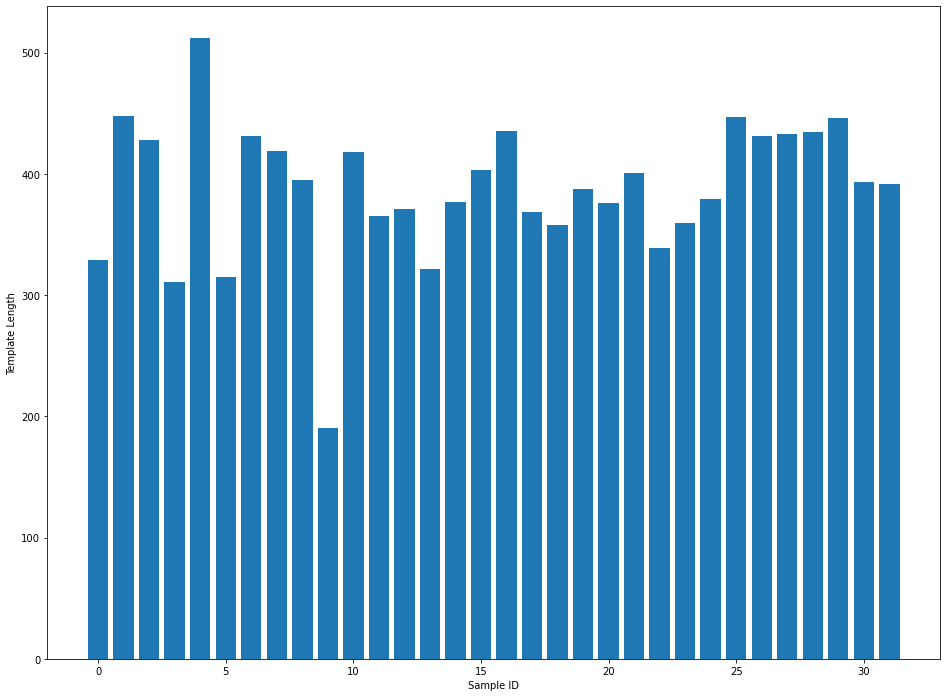

# Masked Reference Assembly (all samples) Report

## Parameters:

```python
------- ipyrad params file (v.0.9.62)-------------------------------------------
phys_both                      ## [0] [assembly_name]: Assembly name. Used to name output directories for assembly steps
/gpfs/ysm/scratch60/dunn/rb956/finalproject/ipyrad09 ## [1] [project_dir]: Project dir (made in curdir if not present)
Merged: phys_idx1, phys_idx3   ## [2] [raw_fastq_path]: Location of raw non-demultiplexed fastq files
Merged: phys_idx1, phys_idx3   ## [3] [barcodes_path]: Location of barcodes file
Merged: phys_idx1, phys_idx3   ## [4] [sorted_fastq_path]: Location of demultiplexed/sorted fastq files
reference                      ## [5] [assembly_method]: Assembly method (denovo, reference)
/gpfs/ysm/scratch60/dunn/rb956/finalproject/ipyrad09/reference/physalia_pilonPolished.hardMask.fa ## [6] [reference_sequence]: Location of reference sequence file
pairddrad                      ## [7] [datatype]: Datatype (see docs): rad, gbs, ddrad, etc.
CATG, AATT                     ## [8] [restriction_overhang]: Restriction overhang (cut1,) or (cut1, cut2)
5                              ## [9] [max_low_qual_bases]: Max low quality base calls (Q<20) in a read
30                             ## [10] [phred_Qscore_offset]: phred Q score offset (33 is default and very standard)
6                              ## [11] [mindepth_statistical]: Min depth for statistical base calling
6                              ## [12] [mindepth_majrule]: Min depth for majority-rule base calling
10000                          ## [13] [maxdepth]: Max cluster depth within samples
0.85                           ## [14] [clust_threshold]: Clustering threshold for de novo assembly
1                              ## [15] [max_barcode_mismatch]: Max number of allowable mismatches in barcodes
2                              ## [16] [filter_adapters]: Filter for adapters/primers (1 or 2=stricter)
35                             ## [17] [filter_min_trim_len]: Min length of reads after adapter trim
2                              ## [18] [max_alleles_consens]: Max alleles per site in consensus sequences
0.05                           ## [19] [max_Ns_consens]: Max N's (uncalled bases) in consensus
0.05                           ## [20] [max_Hs_consens]: Max Hs (heterozygotes) in consensus
4                              ## [21] [min_samples_locus]: Min # samples per locus for output
0.2                            ## [22] [max_SNPs_locus]: Max # SNPs per locus
5                              ## [23] [max_Indels_locus]: Max # of indels per locus
0.5                            ## [24] [max_shared_Hs_locus]: Max # heterozygous sites per locus
4, 0, 8, 0                     ## [25] [trim_reads]: Trim raw read edges (R1>, <R1, R2>, <R2) (see docs)
0, 0, 0, 0                     ## [26] [trim_loci]: Trim locus edges (see docs) (R1>, <R1, R2>, <R2)
p, s, l                        ## [27] [output_formats]: Output formats (see docs)
                               ## [28] [pop_assign_file]: Path to population assignment file
                               ## [29] [reference_as_filter]: Reads mapped to this reference are removed in step 3
```

## Results


```python
from IPython.display import display, Markdown
import numpy as np
import matplotlib.pyplot as plt
import pandas as pd
```

### Tables
Table 1: Reference-based Assembly Results


```python
assembly = pd.read_csv("assembly_both_stats.csv", header=0, index_col = 0)
assembly = assembly.drop(columns = ['state', 'reads_raw', 'refseq_unmapped_reads'])
assembly
```


| sample        |   reads_passed_filter |   refseq_mapped_reads |   clusters_total |   clusters_hidepth |   hetero_est |   error_est |   reads_consens |   loci_in_assembly |
|:--------------|----------------------:|----------------------:|-----------------:|-------------------:|-------------:|------------:|----------------:|-------------------:|
| 13_TX2016_043 |           2.2767e+06  |      590406           |           203003 |              10849 |     0.015853 |    0.010342 |            5782 |               3895 |
| 42_TX2016_046 |           2.6215e+06  |      262858           |            99758 |               4305 |     0.012114 |    0.009876 |            3110 |               2236 |
| 59_TX2016_048 |           2.50358e+06 |      237785           |            93409 |               3752 |     0.010275 |    0.011022 |            2622 |               1893 |
| 6_TX2017_027  |           1.41032e+06 |      629930           |           216153 |              12053 |     0.016929 |    0.010515 |            6341 |               3964 |
| 82_TX2016_049 |      411433           |       90606           |            33984 |               1540 |     0.010552 |    0.00966  |            1282 |                907 |
| 8_TX2017_028  |           1.13714e+07 |           1.76268e+06 |           436346 |              38193 |     0.020348 |    0.010031 |           16997 |               8083 |
| Bermuda_100   |           1.32326e+07 |      779220           |           191361 |              13577 |     0.010553 |    0.007429 |            9722 |               6183 |
| Bermuda_103   |           2.88689e+06 |      719567           |           160256 |              11729 |     0.012236 |    0.007638 |            7757 |               5431 |
| Bermuda_15    |           2.58688e+06 |      457198           |           120439 |               8626 |     0.012143 |    0.00707  |            5641 |               3928 |
| Bermuda_19    |           1.48893e+06 |      593382           |           190964 |              10826 |     0.022148 |    0.010936 |            4390 |               2200 |
| Bermuda_28    |           5.46699e+06 |      324328           |           115132 |               5447 |     0.014018 |    0.009286 |            3339 |               2217 |
| Bermuda_30    |           2.90583e+06 |      670183           |           163859 |              11714 |     0.013441 |    0.00796  |            6880 |               4669 |
| Bermuda_54    |           3.88378e+06 |      290566           |           114925 |               4860 |     0.015167 |    0.011542 |            2753 |               1783 |
| Bermuda_55    |           6.54616e+06 |           1.53062e+06 |           313869 |              30146 |     0.018823 |    0.006847 |           15056 |               8339 |
| Bermuda_63    |           1.78458e+06 |      488101           |           124526 |               8340 |     0.011183 |    0.009127 |            4987 |               3574 |
| Bermuda_65    |           2.96695e+06 |      412329           |           127306 |               7892 |     0.011476 |    0.008933 |            5348 |               3822 |
| Bermuda_67    |           6.6299e+06  |      905787           |           210977 |              19199 |     0.012225 |    0.007461 |           13033 |               6515 |
| Bermuda_68    |           3.96649e+06 |      619371           |           187468 |              11088 |     0.013569 |    0.009433 |            6487 |               4569 |
| Bermuda_69    |           8.98048e+06 |      885365           |           238693 |              16022 |     0.01436  |    0.00831  |            9339 |               6194 |
| Bermuda_79    |           3.43366e+06 |      271141           |           108421 |               4103 |     0.013827 |    0.012212 |            2428 |               1558 |
| Bermuda_8     |           1.88972e+06 |      609756           |           145454 |              10556 |     0.012896 |    0.007998 |            6703 |               4732 |
| Bermuda_80    |           1.01372e+07 |      457497           |           159280 |               8152 |     0.011536 |    0.010488 |            5069 |               3426 |
| Bermuda_81    |           1.75483e+06 |      708054           |           178380 |              12500 |     0.014281 |    0.009211 |            6936 |               4557 |
| Bermuda_83    |           2.54108e+06 |      747667           |           176898 |              12892 |     0.014463 |    0.007027 |            7599 |               5229 |
| Bermuda_84    |           3.21148e+06 |      664025           |           198775 |              11031 |     0.012201 |    0.009674 |            6930 |               4970 |
| Bermuda_85    |           1.70997e+06 |      327186           |           107137 |               5721 |     0.010653 |    0.009438 |            4273 |               3140 |
| Bermuda_94    |           3.46554e+06 |      359492           |           115528 |               6213 |     0.011    |    0.008792 |            4422 |               3336 |
| Guam_104460   |           6.92951e+06 |      448564           |            90296 |               7191 |     0.014548 |    0.0075   |            5865 |               3000 |
| Guam_104461   |           6.28647e+06 |      356079           |            85791 |               5334 |     0.01468  |    0.008895 |            4184 |               2303 |
| Guam_104464   |           3.82415e+06 |      356916           |            72260 |               5287 |     0.014448 |    0.007357 |            4359 |               2344 |
| Guam_104465   |           1.27063e+07 |      811268           |           160025 |              13003 |     0.016428 |    0.007687 |            9585 |               4235 |
| South_Africa  |           6.76697e+06 |      466603           |            88315 |               5621 |     0.015264 |    0.0072   |            4250 |               1770 |


Table 2: Reference-based Assembly Summary States


```python
assembly.describe().drop(index = "count")
```


<div>
<style scoped>
    .dataframe tbody tr th:only-of-type {
        vertical-align: middle;
    }

    .dataframe tbody tr th {
        vertical-align: top;
    }

    .dataframe thead th {
        text-align: right;
    }
</style>
<table border="1" class="dataframe">
  <thead>
    <tr style="text-align: right;">
      <th></th>
      <th>reads_passed_filter</th>
      <th>refseq_mapped_reads</th>
      <th>clusters_total</th>
      <th>clusters_hidepth</th>
      <th>hetero_est</th>
      <th>error_est</th>
      <th>reads_consens</th>
      <th>loci_in_assembly</th>
    </tr>
  </thead>
  <tbody>
    <tr>
      <th>mean</th>
      <td>4.643073e+06</td>
      <td>5.885792e+05</td>
      <td>157155.875000</td>
      <td>10555.062500</td>
      <td>0.013864</td>
      <td>0.008966</td>
      <td>6358.406250</td>
      <td>3906.312500</td>
    </tr>
    <tr>
      <th>std</th>
      <td>3.422796e+06</td>
      <td>3.449160e+05</td>
      <td>76441.918347</td>
      <td>7412.785041</td>
      <td>0.002829</td>
      <td>0.001455</td>
      <td>3534.143341</td>
      <td>1840.792474</td>
    </tr>
    <tr>
      <th>min</th>
      <td>4.114330e+05</td>
      <td>9.060600e+04</td>
      <td>33984.000000</td>
      <td>1540.000000</td>
      <td>0.010275</td>
      <td>0.006847</td>
      <td>1282.000000</td>
      <td>907.000000</td>
    </tr>
    <tr>
      <th>25%</th>
      <td>2.446858e+06</td>
      <td>3.567068e+05</td>
      <td>108100.000000</td>
      <td>5577.500000</td>
      <td>0.011969</td>
      <td>0.007604</td>
      <td>4267.250000</td>
      <td>2286.250000</td>
    </tr>
    <tr>
      <th>50%</th>
      <td>3.322566e+06</td>
      <td>5.392535e+05</td>
      <td>152367.000000</td>
      <td>9591.000000</td>
      <td>0.013698</td>
      <td>0.009030</td>
      <td>5711.500000</td>
      <td>3858.500000</td>
    </tr>
    <tr>
      <th>75%</th>
      <td>6.567094e+06</td>
      <td>7.109322e+05</td>
      <td>191063.250000</td>
      <td>12164.750000</td>
      <td>0.014802</td>
      <td>0.009915</td>
      <td>7101.750000</td>
      <td>4791.500000</td>
    </tr>
    <tr>
      <th>max</th>
      <td>1.323264e+07</td>
      <td>1.762685e+06</td>
      <td>436346.000000</td>
      <td>38193.000000</td>
      <td>0.022148</td>
      <td>0.012212</td>
      <td>16997.000000</td>
      <td>8339.000000</td>
    </tr>
  </tbody>
</table>
</div>


```python
tlens = pd.read_csv("phys_both_consens/TLENs.csv",header=None, names =["Template", "Sample", "Obs_TLEN"])
tlens.describe().drop(index = "count")
```


<div>
<style scoped>
    .dataframe tbody tr th:only-of-type {
        vertical-align: middle;
    }

    .dataframe tbody tr th {
        vertical-align: top;
    }

    .dataframe thead th {
        text-align: right;
    }
</style>
<table border="1" class="dataframe">
  <thead>
    <tr style="text-align: right;">
      <th></th>
      <th>Template</th>
      <th>Obs_TLEN</th>
    </tr>
  </thead>
  <tbody>
    <tr>
      <th>mean</th>
      <td>4131.187734</td>
      <td>377.954804</td>
    </tr>
    <tr>
      <th>std</th>
      <td>3398.281958</td>
      <td>357.845068</td>
    </tr>
    <tr>
      <th>min</th>
      <td>1.000000</td>
      <td>35.000000</td>
    </tr>
    <tr>
      <th>25%</th>
      <td>1600.000000</td>
      <td>101.000000</td>
    </tr>
    <tr>
      <th>50%</th>
      <td>3317.000000</td>
      <td>415.000000</td>
    </tr>
    <tr>
      <th>75%</th>
      <td>5635.000000</td>
      <td>504.000000</td>
    </tr>
    <tr>
      <th>max</th>
      <td>16997.000000</td>
      <td>3137.000000</td>
    </tr>
  </tbody>
</table>
</div>


```python
tlens_pivot = tlens.pivot_table(columns = ["Sample"], values = ["Obs_TLEN"], index = ["Template"])
tlens_pivot.columns = assembly.index

tlens_pivot_stats = tlens_pivot.describe().transpose()
tlens_pivot_stats
```


<div>
<style scoped>
    .dataframe tbody tr th:only-of-type {
        vertical-align: middle;
    }

    .dataframe tbody tr th {
        vertical-align: top;
    }

    .dataframe thead th {
        text-align: right;
    }
</style>
<table border="1" class="dataframe">
  <thead>
    <tr style="text-align: right;">
      <th></th>
      <th>count</th>
      <th>mean</th>
      <th>std</th>
      <th>min</th>
      <th>25%</th>
      <th>50%</th>
      <th>75%</th>
      <th>max</th>
    </tr>
    <tr>
      <th>sample</th>
      <th></th>
      <th></th>
      <th></th>
      <th></th>
      <th></th>
      <th></th>
      <th></th>
      <th></th>
    </tr>
  </thead>
  <tbody>
    <tr>
      <th>13_TX2016_043</th>
      <td>5782.0</td>
      <td>328.951574</td>
      <td>354.429483</td>
      <td>35.0</td>
      <td>72.00</td>
      <td>287.0</td>
      <td>486.0</td>
      <td>3137.0</td>
    </tr>
    <tr>
      <th>42_TX2016_046</th>
      <td>3110.0</td>
      <td>447.880386</td>
      <td>404.640167</td>
      <td>35.0</td>
      <td>185.25</td>
      <td>471.0</td>
      <td>515.0</td>
      <td>3137.0</td>
    </tr>
    <tr>
      <th>59_TX2016_048</th>
      <td>2622.0</td>
      <td>427.740656</td>
      <td>381.206150</td>
      <td>35.0</td>
      <td>143.00</td>
      <td>459.0</td>
      <td>513.0</td>
      <td>3137.0</td>
    </tr>
    <tr>
      <th>6_TX2017_027</th>
      <td>6341.0</td>
      <td>310.996688</td>
      <td>350.308142</td>
      <td>35.0</td>
      <td>71.00</td>
      <td>209.0</td>
      <td>476.0</td>
      <td>3137.0</td>
    </tr>
    <tr>
      <th>82_TX2016_049</th>
      <td>1282.0</td>
      <td>512.560062</td>
      <td>427.567489</td>
      <td>35.0</td>
      <td>386.00</td>
      <td>485.5</td>
      <td>527.0</td>
      <td>3127.0</td>
    </tr>
    <tr>
      <th>8_TX2017_028</th>
      <td>16997.0</td>
      <td>315.339060</td>
      <td>346.665598</td>
      <td>35.0</td>
      <td>79.00</td>
      <td>244.0</td>
      <td>451.0</td>
      <td>3137.0</td>
    </tr>
    <tr>
      <th>Bermuda_100</th>
      <td>9722.0</td>
      <td>431.066962</td>
      <td>314.744457</td>
      <td>35.0</td>
      <td>359.25</td>
      <td>446.0</td>
      <td>503.0</td>
      <td>3137.0</td>
    </tr>
    <tr>
      <th>Bermuda_103</th>
      <td>7757.0</td>
      <td>419.117829</td>
      <td>359.529713</td>
      <td>35.0</td>
      <td>143.00</td>
      <td>454.0</td>
      <td>514.0</td>
      <td>3137.0</td>
    </tr>
    <tr>
      <th>Bermuda_15</th>
      <td>5641.0</td>
      <td>395.194646</td>
      <td>351.770735</td>
      <td>35.0</td>
      <td>125.00</td>
      <td>427.0</td>
      <td>511.0</td>
      <td>3137.0</td>
    </tr>
    <tr>
      <th>Bermuda_19</th>
      <td>4390.0</td>
      <td>190.771071</td>
      <td>409.903404</td>
      <td>35.0</td>
      <td>50.00</td>
      <td>73.0</td>
      <td>137.0</td>
      <td>3137.0</td>
    </tr>
    <tr>
      <th>Bermuda_28</th>
      <td>3339.0</td>
      <td>418.286613</td>
      <td>424.549689</td>
      <td>35.0</td>
      <td>96.00</td>
      <td>443.0</td>
      <td>521.0</td>
      <td>3137.0</td>
    </tr>
    <tr>
      <th>Bermuda_30</th>
      <td>6880.0</td>
      <td>365.625000</td>
      <td>374.783218</td>
      <td>35.0</td>
      <td>80.00</td>
      <td>410.0</td>
      <td>513.0</td>
      <td>3137.0</td>
    </tr>
    <tr>
      <th>Bermuda_54</th>
      <td>2753.0</td>
      <td>371.334181</td>
      <td>424.610530</td>
      <td>35.0</td>
      <td>70.00</td>
      <td>361.0</td>
      <td>509.0</td>
      <td>3137.0</td>
    </tr>
    <tr>
      <th>Bermuda_55</th>
      <td>15056.0</td>
      <td>321.956296</td>
      <td>344.041420</td>
      <td>35.0</td>
      <td>74.00</td>
      <td>262.0</td>
      <td>483.0</td>
      <td>3137.0</td>
    </tr>
    <tr>
      <th>Bermuda_63</th>
      <td>4987.0</td>
      <td>376.940846</td>
      <td>397.516760</td>
      <td>35.0</td>
      <td>84.00</td>
      <td>413.0</td>
      <td>515.0</td>
      <td>3137.0</td>
    </tr>
    <tr>
      <th>Bermuda_65</th>
      <td>5348.0</td>
      <td>402.989716</td>
      <td>338.294270</td>
      <td>35.0</td>
      <td>126.00</td>
      <td>460.0</td>
      <td>522.0</td>
      <td>3137.0</td>
    </tr>
    <tr>
      <th>Bermuda_67</th>
      <td>13033.0</td>
      <td>435.751400</td>
      <td>331.478608</td>
      <td>35.0</td>
      <td>213.00</td>
      <td>479.0</td>
      <td>525.0</td>
      <td>3137.0</td>
    </tr>
    <tr>
      <th>Bermuda_68</th>
      <td>6487.0</td>
      <td>368.608756</td>
      <td>373.566136</td>
      <td>35.0</td>
      <td>86.00</td>
      <td>409.0</td>
      <td>507.0</td>
      <td>3137.0</td>
    </tr>
    <tr>
      <th>Bermuda_69</th>
      <td>9339.0</td>
      <td>357.884998</td>
      <td>336.989104</td>
      <td>35.0</td>
      <td>91.00</td>
      <td>410.0</td>
      <td>492.0</td>
      <td>3137.0</td>
    </tr>
    <tr>
      <th>Bermuda_79</th>
      <td>2428.0</td>
      <td>387.898682</td>
      <td>436.542009</td>
      <td>35.0</td>
      <td>75.75</td>
      <td>382.0</td>
      <td>512.0</td>
      <td>3137.0</td>
    </tr>
    <tr>
      <th>Bermuda_8</th>
      <td>6703.0</td>
      <td>375.664180</td>
      <td>360.835600</td>
      <td>35.0</td>
      <td>99.00</td>
      <td>420.0</td>
      <td>514.0</td>
      <td>3137.0</td>
    </tr>
    <tr>
      <th>Bermuda_80</th>
      <td>5069.0</td>
      <td>400.898599</td>
      <td>379.416251</td>
      <td>35.0</td>
      <td>104.00</td>
      <td>436.0</td>
      <td>508.0</td>
      <td>3137.0</td>
    </tr>
    <tr>
      <th>Bermuda_81</th>
      <td>6936.0</td>
      <td>338.637687</td>
      <td>385.079712</td>
      <td>35.0</td>
      <td>75.00</td>
      <td>250.0</td>
      <td>502.0</td>
      <td>3137.0</td>
    </tr>
    <tr>
      <th>Bermuda_83</th>
      <td>7599.0</td>
      <td>359.425188</td>
      <td>368.306002</td>
      <td>35.0</td>
      <td>86.50</td>
      <td>394.0</td>
      <td>506.0</td>
      <td>3137.0</td>
    </tr>
    <tr>
      <th>Bermuda_84</th>
      <td>6930.0</td>
      <td>379.326696</td>
      <td>328.911896</td>
      <td>35.0</td>
      <td>128.00</td>
      <td>419.5</td>
      <td>498.0</td>
      <td>3137.0</td>
    </tr>
    <tr>
      <th>Bermuda_85</th>
      <td>4273.0</td>
      <td>447.263281</td>
      <td>359.050424</td>
      <td>35.0</td>
      <td>308.00</td>
      <td>469.0</td>
      <td>517.0</td>
      <td>3133.0</td>
    </tr>
    <tr>
      <th>Bermuda_94</th>
      <td>4422.0</td>
      <td>431.235640</td>
      <td>341.910455</td>
      <td>35.0</td>
      <td>255.00</td>
      <td>463.0</td>
      <td>514.0</td>
      <td>3130.0</td>
    </tr>
    <tr>
      <th>Guam_104460</th>
      <td>5865.0</td>
      <td>432.878431</td>
      <td>303.075805</td>
      <td>35.0</td>
      <td>335.00</td>
      <td>445.0</td>
      <td>506.0</td>
      <td>3137.0</td>
    </tr>
    <tr>
      <th>Guam_104461</th>
      <td>4184.0</td>
      <td>434.890774</td>
      <td>344.967598</td>
      <td>35.0</td>
      <td>269.00</td>
      <td>445.0</td>
      <td>505.0</td>
      <td>3136.0</td>
    </tr>
    <tr>
      <th>Guam_104464</th>
      <td>4359.0</td>
      <td>446.582014</td>
      <td>348.107894</td>
      <td>35.0</td>
      <td>294.00</td>
      <td>453.0</td>
      <td>513.0</td>
      <td>3135.0</td>
    </tr>
    <tr>
      <th>Guam_104465</th>
      <td>9585.0</td>
      <td>393.382055</td>
      <td>297.619178</td>
      <td>35.0</td>
      <td>197.00</td>
      <td>413.0</td>
      <td>481.0</td>
      <td>3137.0</td>
    </tr>
    <tr>
      <th>South_Africa</th>
      <td>4250.0</td>
      <td>391.533176</td>
      <td>316.652781</td>
      <td>35.0</td>
      <td>156.00</td>
      <td>420.0</td>
      <td>498.0</td>
      <td>3137.0</td>
    </tr>
  </tbody>
</table>
</div>


### Figures:


```python
fig, [ax1, ax2] = plt.subplots(figsize=(16,24),nrows = 2)
ypos = np.arange(len(assembly)) + 1

ax1.hlines(ypos, 0, assembly["reads_passed_filter"], color='lightblue')  # Stems
ax1.plot(assembly["reads_passed_filter"], ypos, 'o')  # Stem ends
ax1.set_yticks(ypos)
ax1.set_yticklabels(assembly.index)

ax1.set_ylabel("Sample ID")
ax1.set_xlabel("Reads Passed Filter")

ax2.hlines(ypos, 0, assembly["reads_consens"], color='lightblue')  # Stems
ax2.plot(assembly["reads_consens"], ypos, 'o')  # Stem ends
ax2.set_yticks(ypos)
ax2.set_yticklabels(assembly.index)

ax2.set_ylabel("Sample ID")
ax2.set_xlabel("Consensus Reads")


```


    Text(0.5, 0, 'Consensus Reads')


    

    


```python
xpos = np.arange(len(assembly.index))

fig, ax = plt.subplots(figsize = (16,12))

ax.bar(xpos, tlens_pivot_stats['mean'])
ax.set_xticks(xpos)
ax.set_xticklabels(assembly.index)
plt.xticks(rotation=45) 

ax.set_xlabel("Sample ID")
ax.set_ylabel("Template Length")
```


    Text(0, 0.5, 'Template Length')


    

    

