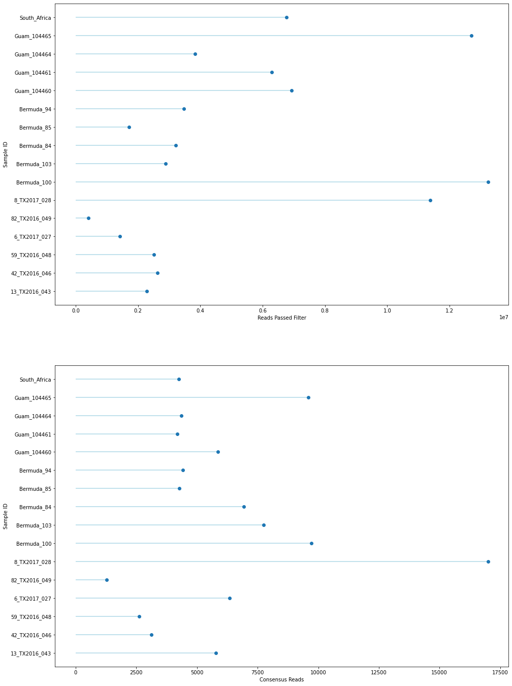

# Masked Reference Assembly (with similar # of samples) Report

## Parameters:

```python
------- ipyrad params file (v.0.9.62)-------------------------------------------
phys_idx3                      ## [0] [assembly_name]: Assembly name. Used to name output directories for assembly steps
/gpfs/ysm/scratch60/dunn/rb956/finalproject/ipyrad09 ## [1] [project_dir]: Project dir (made in curdir if not present)
                               ## [2] [raw_fastq_path]: Location of raw non-demultiplexed fastq files
raw_data/barcode_idx3                              ## [3] [barcodes_path]: Location of barcodes file
raw_data/phys_idx3_clone_filter/*.fastq.gz           ## [4] [sorted_fastq_path]: Location of demultiplexed/sorted fastq files
reference                         ## [5] [assembly_method]: Assembly method (denovo, reference)
reference/physalia_pilonPolished.hardMask.fa                               ## [6] [reference_sequence]: Location of reference sequence file
pairddrad                            ## [7] [datatype]: Datatype (see docs): rad, gbs, ddrad, etc.
CATG,AATT                         ## [8] [restriction_overhang]: Restriction overhang (cut1,) or (cut1, cut2)
5                              ## [9] [max_low_qual_bases]: Max low quality base calls (Q<20) in a read
30                             ## [10] [phred_Qscore_offset]: phred Q score offset (33 is default and very standard)
6                              ## [11] [mindepth_statistical]: Min depth for statistical base calling
6                              ## [12] [mindepth_majrule]: Min depth for majority-rule base calling
10000                          ## [13] [maxdepth]: Max cluster depth within samples
0.85                           ## [14] [clust_threshold]: Clustering threshold for de novo assembly
1                              ## [15] [max_barcode_mismatch]: Max number of allowable mismatches in barcodes
2                              ## [16] [filter_adapters]: Filter for adapters/primers (1 or 2=stricter)
35                             ## [17] [filter_min_trim_len]: Min length of reads after adapter trim
2                              ## [18] [max_alleles_consens]: Max alleles per site in consensus sequences
0.05                           ## [19] [max_Ns_consens]: Max N's (uncalled bases) in consensus
0.05                           ## [20] [max_Hs_consens]: Max Hs (heterozygotes) in consensus
4                              ## [21] [min_samples_locus]: Min # samples per locus for output
0.2                            ## [22] [max_SNPs_locus]: Max # SNPs per locus
5                              ## [23] [max_Indels_locus]: Max # of indels per locus
0.5                            ## [24] [max_shared_Hs_locus]: Max # heterozygous sites per locus
4, 0, 8, 0                     ## [25] [trim_reads]: Trim raw read edges (R1>, <R1, R2>, <R2) (see docs)
0, 0, 0, 0                     ## [26] [trim_loci]: Trim locus edges (see docs) (R1>, <R1, R2>, <R2)
p, s, l                        ## [27] [output_formats]: Output formats (see docs)
                               ## [28] [pop_assign_file]: Path to population assignment file
                               ## [29] [reference_as_filter]: Reads mapped to this reference are removed in step 3


```

## Results

### Tables
Table 1: Reference-based Assembly Results


| sample        |   reads_passed_filter |   refseq_mapped_reads |   clusters_total |   clusters_hidepth |   hetero_est |   error_est |   reads_consens |   loci_in_assembly |
|:--------------|----------------------:|----------------------:|-----------------:|-------------------:|-------------:|------------:|----------------:|-------------------:|
| 13_TX2016_043 |           2.2767e+06  |      590406           |           203003 |              10849 |     0.015853 |    0.010342 |            5782 |               3279 |
| 42_TX2016_046 |           2.6215e+06  |      262858           |            99758 |               4305 |     0.012114 |    0.009876 |            3110 |               2009 |
| 59_TX2016_048 |           2.50358e+06 |      237785           |            93409 |               3752 |     0.010275 |    0.011022 |            2621 |               1818 |
| 6_TX2017_027  |           1.41032e+06 |      629930           |           216153 |              12053 |     0.016929 |    0.010515 |            6341 |               3174 |
| 82_TX2016_049 |      411433           |       90606           |            33984 |               1540 |     0.010552 |    0.00966  |            1282 |                906 |
| 8_TX2017_028  |           1.13714e+07 |           1.76268e+06 |           436346 |              38193 |     0.020348 |    0.010031 |           16997 |               5121 |
| Bermuda_100   |           1.32326e+07 |      779220           |           191361 |              13577 |     0.010553 |    0.007429 |            9722 |               4583 |
| Bermuda_103   |           2.88689e+06 |      719567           |           160256 |              11729 |     0.012236 |    0.007638 |            7757 |               4035 |
| Bermuda_84    |           3.21148e+06 |      664025           |           198775 |              11031 |     0.012201 |    0.009674 |            6930 |               4106 |
| Bermuda_85    |           1.70997e+06 |      327186           |           107137 |               5721 |     0.010653 |    0.009438 |            4273 |               2729 |
| Bermuda_94    |           3.46554e+06 |      359492           |           115528 |               6213 |     0.011    |    0.008792 |            4422 |               2919 |
| Guam_104460   |           6.92951e+06 |      448564           |            90296 |               7191 |     0.014548 |    0.0075   |            5865 |               2689 |
| Guam_104461   |           6.28647e+06 |      356079           |            85791 |               5334 |     0.01468  |    0.008895 |            4184 |               2146 |
| Guam_104464   |           3.82415e+06 |      356916           |            72260 |               5287 |     0.014448 |    0.007357 |            4359 |               2187 |
| Guam_104465   |           1.27063e+07 |      811268           |           160025 |              13003 |     0.016428 |    0.007687 |            9585 |               3516 |
| South_Africa  |           6.76697e+06 |      466603           |            88315 |               5621 |     0.015264 |    0.0072   |            4250 |               1583 |


Table 2: Reference-based Assembly Summary Statistics


| stat   |   reads_passed_filter |   refseq_mapped_reads |   clusters_total |   clusters_hidepth |   hetero_est |   error_est |   reads_consens |   loci_in_assembly |
|:-------|----------------------:|----------------------:|-----------------:|-------------------:|-------------:|------------:|----------------:|-------------------:|
| mean   |           5.10093e+06 |      553949           |         147025   |            9712.44 |   0.0136301  |  0.008941   |         6092.5  |            2925    |
| std    |           4.09526e+06 |      383838           |          94191.8 |            8450.11 |   0.00290208 |  0.00129953 |         3725.51 |            1152.46 |
| min    |      411433           |       90606           |          33984   |            1540    |   0.010275   |  0.0072     |         1282    |             906    |
| 25%    |           2.44686e+06 |      348856           |          89800.8 |            5322.25 |   0.0109132  |  0.0076035  |         4233.5  |            2111.75 |
| 50%    |           3.33851e+06 |      457584           |         111332   |            6702    |   0.013342   |  0.0091665  |         5102    |            2824    |
| 75%    |           6.80761e+06 |      677910           |         193214   |           11810    |   0.0154112  |  0.00991475 |         7136.75 |            3645.75 |
| max    |           1.32326e+07 |           1.76268e+06 |         436346   |           38193    |   0.020348   |  0.011022   |        16997    |            5121    |


Table 3: Template Lengths of Samples


| sample        |   count |    mean |     std |   min |    25% |   50% |   75% |   max |
|:--------------|--------:|--------:|--------:|------:|-------:|------:|------:|------:|
| 13_TX2016_043 |    5782 | 328.952 | 354.429 |    35 |  72    | 287   |   486 |  3137 |
| 42_TX2016_046 |    3110 | 447.88  | 404.64  |    35 | 185.25 | 471   |   515 |  3137 |
| 59_TX2016_048 |    2621 | 426.934 | 379.032 |    35 | 143    | 459   |   513 |  3137 |
| 6_TX2017_027  |    6341 | 310.997 | 350.308 |    35 |  71    | 209   |   476 |  3137 |
| 82_TX2016_049 |    1282 | 512.56  | 427.567 |    35 | 386    | 485.5 |   527 |  3127 |
| 8_TX2017_028  |   16997 | 315.339 | 346.666 |    35 |  79    | 244   |   451 |  3137 |
| Bermuda_100   |    9722 | 431.067 | 314.744 |    35 | 359.25 | 446   |   503 |  3137 |
| Bermuda_103   |    7757 | 419.118 | 359.53  |    35 | 143    | 454   |   514 |  3137 |
| Bermuda_84    |    6930 | 379.327 | 328.912 |    35 | 128    | 419.5 |   498 |  3137 |
| Bermuda_85    |    4273 | 447.263 | 359.05  |    35 | 308    | 469   |   517 |  3133 |
| Bermuda_94    |    4422 | 431.236 | 341.91  |    35 | 255    | 463   |   514 |  3130 |
| Guam_104460   |    5865 | 432.878 | 303.076 |    35 | 335    | 445   |   506 |  3137 |
| Guam_104461   |    4184 | 434.891 | 344.968 |    35 | 269    | 445   |   505 |  3136 |
| Guam_104464   |    4359 | 446.582 | 348.108 |    35 | 294    | 453   |   513 |  3135 |
| Guam_104465   |    9585 | 393.382 | 297.619 |    35 | 197    | 413   |   481 |  3137 |
| South_Africa  |    4250 | 391.533 | 316.653 |    35 | 156    | 420   |   498 |  3137 |


### Figures


    Text(0.5, 0, 'Consensus Reads')


    

    


    Text(0, 0.5, 'Template Length')


    

    

