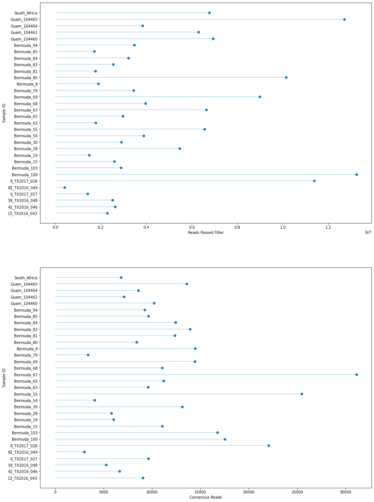
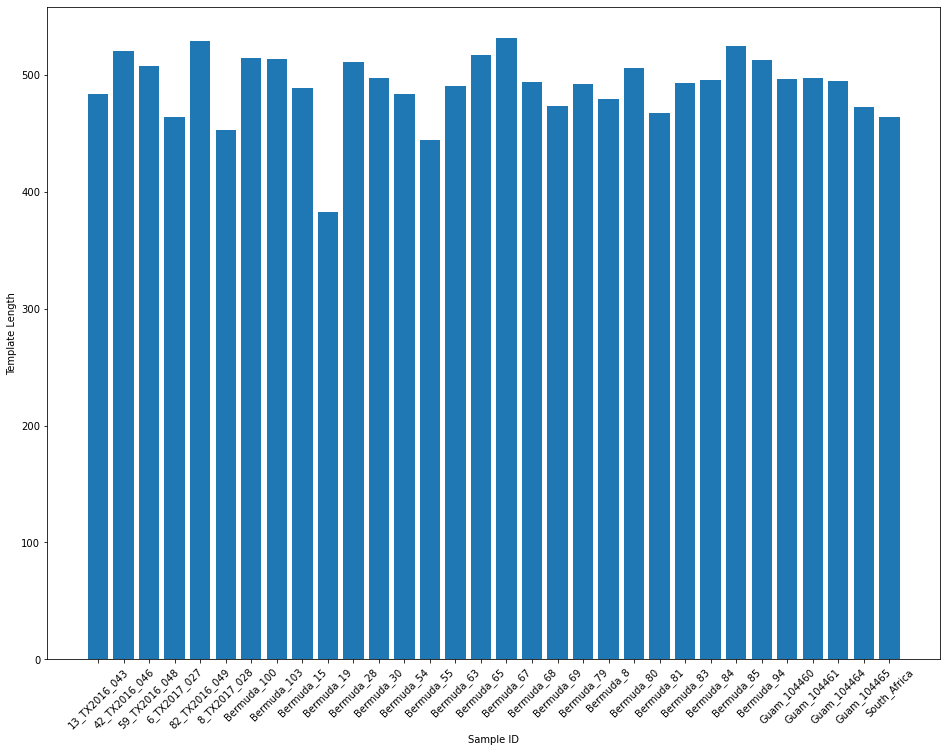
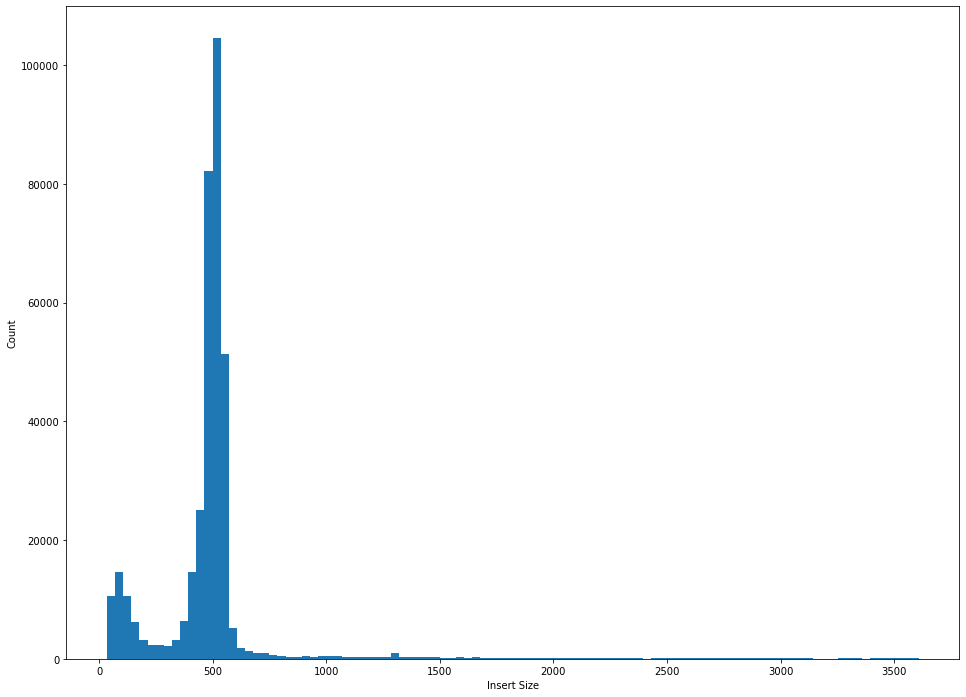

# Unmasked Reference Assembly (all samples) Report

## Parameters:

```python
------- ipyrad params file (v.0.9.62)-------------------------------------------
phys_unmasked                  ## [0] [assembly_name]: Assembly name. Used to name output directories for assembly steps
/gpfs/ysm/scratch60/dunn/rb956/finalproject/ipyrad09 ## [1] [project_dir]: Project dir (made in curdir if not present)
Merged: phys_idx1, phys_idx3   ## [2] [raw_fastq_path]: Location of raw non-demultiplexed fastq files
Merged: phys_idx1, phys_idx3   ## [3] [barcodes_path]: Location of barcodes file
Merged: phys_idx1, phys_idx3   ## [4] [sorted_fastq_path]: Location of demultiplexed/sorted fastq files
reference                      ## [5] [assembly_method]: Assembly method (denovo, reference)
/gpfs/ysm/scratch60/dunn/rb956/finalproject/ipyrad09/reference/physalia_genome.fa ## [6] [reference_sequence]: Location ofreference sequence file
pairddrad                      ## [7] [datatype]: Datatype (see docs): rad, gbs, ddrad, etc.
CATG, AATT                     ## [8] [restriction_overhang]: Restriction overhang (cut1,) or (cut1, cut2)
5                              ## [9] [max_low_qual_bases]: Max low quality base calls (Q<20) in a read
30                             ## [10] [phred_Qscore_offset]: phred Q score offset (33 is default and very standard)
6                              ## [11] [mindepth_statistical]: Min depth for statistical base calling
6                              ## [12] [mindepth_majrule]: Min depth for majority-rule base calling
10000                          ## [13] [maxdepth]: Max cluster depth within samples
0.85                           ## [14] [clust_threshold]: Clustering threshold for de novo assembly
1                              ## [15] [max_barcode_mismatch]: Max number of allowable mismatches in barcodes
2                              ## [16] [filter_adapters]: Filter for adapters/primers (1 or 2=stricter)
35                             ## [17] [filter_min_trim_len]: Min length of reads after adapter trim
2                              ## [18] [max_alleles_consens]: Max alleles per site in consensus sequences
0.05                           ## [19] [max_Ns_consens]: Max N's (uncalled bases) in consensus
0.05                           ## [20] [max_Hs_consens]: Max Hs (heterozygotes) in consensus
4                              ## [21] [min_samples_locus]: Min # samples per locus for output
0.2                            ## [22] [max_SNPs_locus]: Max # SNPs per locus
5                              ## [23] [max_Indels_locus]: Max # of indels per locus
0.5                            ## [24] [max_shared_Hs_locus]: Max # heterozygous sites per locus
4, 0, 8, 0                     ## [25] [trim_reads]: Trim raw read edges (R1>, <R1, R2>, <R2) (see docs)
0, 0, 0, 0                     ## [26] [trim_loci]: Trim locus edges (see docs) (R1>, <R1, R2>, <R2)
p, s, l                        ## [27] [output_formats]: Output formats (see docs)
                               ## [28] [pop_assign_file]: Path to population assignment file
                               ## [29] [reference_as_filter]: Reads mapped to this reference are removed in step 3
```

## Results

### Tables
Table 1: Reference-based Assembly Results


|               |   reads_passed_filter |   refseq_mapped_reads |   clusters_total |   clusters_hidepth |   hetero_est |   error_est |   reads_consens |   loci_in_assembly |
|:--------------|----------------------:|----------------------:|-----------------:|-------------------:|-------------:|------------:|----------------:|-------------------:|
| 13_TX2016_043 |           2.2767e+06  |      774251           |           372588 |              12404 |     0.006218 |    0.004456 |            9053 |               6624 |
| 42_TX2016_046 |           2.6215e+06  |      333652           |           160496 |               7084 |     0.005858 |    0.004764 |            6647 |               5358 |
| 59_TX2016_048 |           2.50358e+06 |      283569           |           145230 |               5608 |     0.005586 |    0.005082 |            5253 |               4417 |
| 6_TX2017_027  |           1.41032e+06 |      886779           |           423861 |              15603 |     0.008558 |    0.004084 |            9634 |               6075 |
| 82_TX2016_049 |      411433           |      146402           |            71094 |               3229 |     0.006157 |    0.005128 |            2989 |               2486 |
| 8_TX2017_028  |           1.13714e+07 |           1.9375e+06  |           735436 |              36474 |     0.007394 |    0.004745 |           22046 |              11693 |
| Bermuda_100   |           1.32326e+07 |      937227           |           301693 |              19211 |     0.005014 |    0.004596 |           17518 |              12302 |
| Bermuda_103   |           2.88689e+06 |           1.0007e+06  |           303447 |              20608 |     0.006228 |    0.004738 |           16776 |              11969 |
| Bermuda_15    |           2.58688e+06 |      666044           |           239661 |              14005 |     0.00597  |    0.003621 |           11053 |               8058 |
| Bermuda_19    |           1.48893e+06 |      792430           |           372072 |              10913 |     0.009389 |    0.003273 |            6018 |               2724 |
| Bermuda_28    |           5.46699e+06 |      367656           |           177119 |               6486 |     0.006275 |    0.004579 |            5773 |               4243 |
| Bermuda_30    |           2.90583e+06 |      863479           |           304718 |              16537 |     0.005495 |    0.00469  |           13107 |               9469 |
| Bermuda_54    |           3.88378e+06 |      324160           |           177538 |               4748 |     0.007211 |    0.005522 |            4048 |               2949 |
| Bermuda_55    |           6.54616e+06 |           2.00818e+06 |           585767 |              40738 |     0.00722  |    0.003885 |           25466 |              14309 |
| Bermuda_63    |           1.78458e+06 |      606219           |           241587 |              11499 |     0.005809 |    0.005002 |            9607 |               7191 |
| Bermuda_65    |           2.96695e+06 |      570592           |           232189 |              13072 |     0.005777 |    0.004837 |           11216 |               8251 |
| Bermuda_67    |           6.6299e+06  |           1.32092e+06 |           405633 |              38092 |     0.007058 |    0.004907 |           31136 |              12913 |
| Bermuda_68    |           3.96649e+06 |      744717           |           321527 |              12671 |     0.005633 |    0.004917 |           11041 |               8435 |
| Bermuda_69    |           8.98048e+06 |           1.03661e+06 |           415313 |              17759 |     0.0053   |    0.004194 |           14426 |              10176 |
| Bermuda_79    |           3.43366e+06 |      284867           |           159701 |               3855 |     0.006778 |    0.006105 |            3366 |               2492 |
| Bermuda_8     |           1.88972e+06 |      869811           |           300194 |              17696 |     0.006093 |    0.004511 |           14466 |              10061 |
| Bermuda_80    |           1.01372e+07 |      508848           |           251200 |               9735 |     0.006222 |    0.005666 |            8399 |               6190 |
| Bermuda_81    |           1.75483e+06 |      937765           |           344152 |              17207 |     0.006129 |    0.004755 |           12357 |               8540 |
| Bermuda_83    |           2.54108e+06 |           1.05612e+06 |           326085 |              17708 |     0.005671 |    0.003951 |           13920 |              10074 |
| Bermuda_84    |           3.21148e+06 |      876338           |           364138 |              15132 |     0.005121 |    0.004793 |           12414 |               9414 |
| Bermuda_85    |           1.70997e+06 |      513685           |           223755 |              11328 |     0.006271 |    0.00478  |            9638 |               7476 |
| Bermuda_94    |           3.46554e+06 |      459108           |           194240 |               9981 |     0.005221 |    0.004884 |            9228 |               7642 |
| Guam_104460   |           6.92951e+06 |      566554           |           132534 |              10871 |     0.011023 |    0.005712 |           10210 |               4852 |
| Guam_104461   |           6.28647e+06 |      380028           |           118456 |               7577 |     0.010672 |    0.00617  |            7108 |               3765 |
| Guam_104464   |           3.82415e+06 |      465042           |           112983 |               9079 |     0.010224 |    0.005852 |            8605 |               4315 |
| Guam_104465   |           1.27063e+07 |      977926           |           239066 |              15298 |     0.012214 |    0.005497 |           13597 |               5613 |
| South_Africa  |           6.76697e+06 |      659257           |           125284 |               7495 |     0.011663 |    0.005766 |            6787 |               2448 |


Table 2: Reference-based Assembly Summary Statistics


| stat   |   reads_passed_filter |   refseq_mapped_reads |   clusters_total |   clusters_hidepth |   hetero_est |   error_est |   reads_consens |   loci_in_assembly |
|:-------|----------------------:|----------------------:|-----------------:|-------------------:|-------------:|------------:|----------------:|-------------------:|
| mean   |           4.64307e+06 |      754889           |           277461 |           14365.7  |   0.00704537 | 0.00485819  |        11340.7  |            7266.38 |
| std    |           3.4228e+06  |      423550           |           141348 |            9140.54 |   0.00204175 | 0.000691806 |         6195.06 |            3352.94 |
| min    |      411433           |      146402           |            71094 |            3229    |   0.005014   | 0.003273    |         2989    |            2448    |
| 25%    |           2.44686e+06 |      463558           |           172963 |            8703.5  |   0.0057505  | 0.004562    |         7027.75 |            4391.5  |
| 50%    |           3.32257e+06 |      705380           |           246394 |           12537.5  |   0.00622    | 0.0047865   |         9924    |            7333.5  |
| 75%    |           6.56709e+06 |      937362           |           349148 |           17329.2  |   0.0072635  | 0.00522025  |        13677.8  |            9617    |
| max    |           1.32326e+07 |           2.00818e+06 |           735436 |           40738    |   0.012214   | 0.00617     |        31136    |           14309    |


Table 3: Template Lengths of Samples


| index         |   count |    mean |     std |   min |   25% |   50% |    75% |   max |
|:--------------|--------:|--------:|--------:|------:|------:|------:|-------:|------:|
| 13_TX2016_043 |    9053 | 483.546 | 307.523 |    35 | 442   |   495 | 527    |  3580 |
| 42_TX2016_046 |    6647 | 520.33  | 261.501 |    35 | 484   |   503 | 526    |  3607 |
| 59_TX2016_048 |    5253 | 507.899 | 237.239 |    35 | 483   |   502 | 526    |  3608 |
| 6_TX2017_027  |    9634 | 464.039 | 349.081 |    35 | 384   |   485 | 520    |  3605 |
| 82_TX2016_049 |    2989 | 528.962 | 259.185 |    35 | 486   |   506 | 530    |  3519 |
| 8_TX2017_028  |   22046 | 452.616 | 341.179 |    35 | 379   |   467 | 509    |  3608 |
| Bermuda_100   |   17518 | 514.45  | 239.693 |    35 | 473   |   500 | 528    |  3608 |
| Bermuda_103   |   16776 | 513.785 | 305.828 |    35 | 473   |   503 | 530    |  3608 |
| Bermuda_15    |   11053 | 488.911 | 289.769 |    35 | 448   |   500 | 532    |  3608 |
| Bermuda_19    |    6018 | 383.074 | 495.422 |    35 |  87   |   367 | 512    |  3608 |
| Bermuda_28    |    5773 | 511.215 | 308.94  |    36 | 486   |   514 | 536    |  3608 |
| Bermuda_30    |   13107 | 497.215 | 338.775 |    35 | 465   |   507 | 535    |  3608 |
| Bermuda_54    |    4048 | 483.551 | 301.787 |    35 | 475   |   511 | 533.25 |  3605 |
| Bermuda_55    |   25466 | 444.403 | 343.463 |    35 | 259   |   484 | 528    |  3608 |
| Bermuda_63    |    9607 | 490.59  | 344.686 |    35 | 458.5 |   505 | 534    |  3603 |
| Bermuda_65    |   11216 | 516.871 | 265.186 |    35 | 488   |   515 | 539    |  3608 |
| Bermuda_67    |   31136 | 531.655 | 282.019 |    35 | 490   |   517 | 542    |  3608 |
| Bermuda_68    |   11041 | 494.348 | 285.424 |    35 | 472   |   502 | 532    |  3608 |
| Bermuda_69    |   14426 | 473.73  | 267.38  |    35 | 452   |   496 | 530    |  3608 |
| Bermuda_79    |    3366 | 492.206 | 301.754 |    35 | 478   |   512 | 535    |  3595 |
| Bermuda_8     |   14466 | 479.613 | 299.282 |    35 | 428   |   498 | 532    |  3608 |
| Bermuda_80    |    8399 | 506.118 | 264.587 |    35 | 482   |   509 | 532    |  3607 |
| Bermuda_81    |   12357 | 467.441 | 335.277 |    35 | 398   |   499 | 532    |  3608 |
| Bermuda_83    |   13920 | 493.548 | 352.699 |    35 | 449   |   500 | 534    |  3608 |
| Bermuda_84    |   12414 | 495.686 | 257.343 |    35 | 462   |   496 | 527    |  3608 |
| Bermuda_85    |    9638 | 525.045 | 297.551 |    35 | 481   |   505 | 530    |  3608 |
| Bermuda_94    |    9228 | 513.309 | 228.493 |    35 | 480   |   504 | 531    |  3608 |
| Guam_104460   |   10210 | 496.569 | 255.19  |    35 | 450   |   494 | 529    |  3598 |
| Guam_104461   |    7108 | 497.105 | 283.849 |    35 | 450   |   493 | 528    |  3608 |
| Guam_104464   |    8605 | 494.934 | 263.375 |    35 | 451   |   493 | 528    |  3608 |
| Guam_104465   |   13597 | 472.863 | 277.93  |    35 | 414   |   480 | 522    |  3608 |
| South_Africa  |    6787 | 464.505 | 269.798 |    35 | 395   |   482 | 524    |  3608 |


### Figures


    Text(0.5, 0, 'Consensus Reads')


    

    


    Text(0, 0.5, 'Template Length')


    

    


    Text(0, 0.5, 'Count')


    

    

