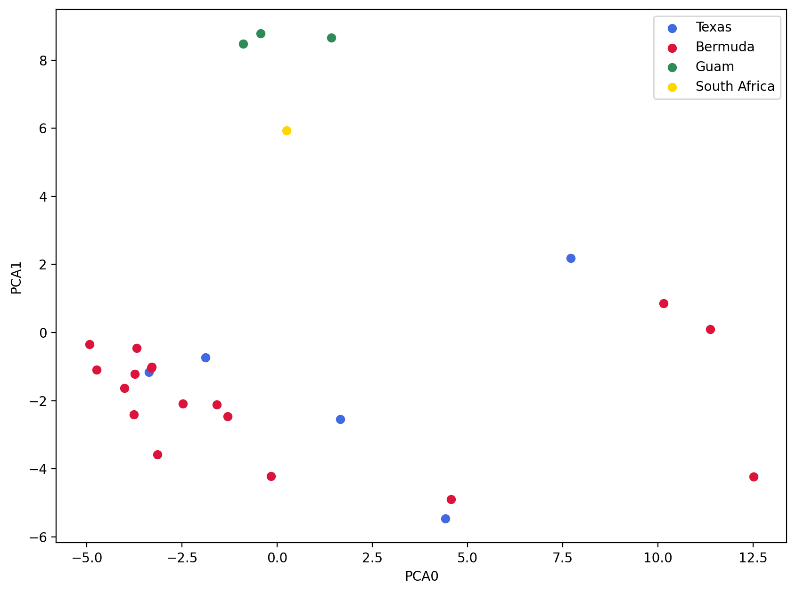

# Masked Assembly

    Text(0, 0.5, 'Count')

    

    

## PCA analysis

    Samples: 29
    Sites before filtering: 101658
    Filtered (indels): 0
    Filtered (bi-allel): 3584
    Filtered (mincov): 154
    Filtered (minmap): 95712
    Filtered (subsample invariant): 8687
    Filtered (minor allele frequency): 0
    Filtered (combined): 96924
    Sites after filtering: 5440
    Sites containing missing values: 5372 (98.75%)
    Missing values in SNP matrix: 30572 (19.38%)
    SNPs (total): 5440
    SNPs (unlinked): 404
    Imputation (null; sets to 0): 100.0%, 0.0%, 0.0%
    Subsampling SNPs: 404/5440

    Text(0, 0.5, 'PCA1')

    

    

    Text(0, 0.5, 'PCA1')

    

    

## Structure Analysis

    80 previous results loaded for run [masked]
    Samples: 29
    Sites before filtering: 101658
    Filtered (indels): 0
    Filtered (bi-allel): 3584
    Filtered (mincov): 100625
    Filtered (minmap): 95712
    Filtered (subsample invariant): 8687
    Filtered (minor allele frequency): 0
    Filtered (combined): 101651
    Sites after filtering: 713
    Sites containing missing values: 645 (90.46%)
    Missing values in SNP matrix: 1024 (4.95%)
    SNPs (total): 713
    SNPs (unlinked): 89
    [####################] 100% 0:03:28 | running 40 structure jobs 

|    |   Nreps |    lnPK |   lnPPK |   deltaK |   estLnProbMean |   estLnProbStdev |
|---:|--------:|--------:|--------:|---------:|----------------:|-----------------:|
|  2 |      20 |   0     |   0     | 0        |        -660.69  |          24.3538 |
|  3 |      20 |   8.625 |  39.595 | 0.525706 |        -652.065 |          75.3178 |
|  4 |      20 | -30.97  |  51.95  | 0.271659 |        -683.035 |         191.233  |
|  5 |      20 |  20.98  |   0     | 0        |        -662.055 |          50.7713 |

    

    

    [K3] 20/20 results permuted across replicates (max_var=0).

    

    

# Unmasked Assembly

    Text(0, 0.5, 'Count')

    

    

## PCA analysis

    Samples: 29
    Sites before filtering: 205250
    Filtered (indels): 0
    Filtered (bi-allel): 5653
    Filtered (mincov): 154
    Filtered (minmap): 191734
    Filtered (subsample invariant): 12116
    Filtered (minor allele frequency): 0
    Filtered (combined): 193483
    Sites after filtering: 12518
    Sites containing missing values: 11700 (93.47%)
    Missing values in SNP matrix: 73046 (20.12%)
    SNPs (total): 12518
    SNPs (unlinked): 524
    Imputation (null; sets to 0): 100.0%, 0.0%, 0.0%
    Subsampling SNPs: 524/12518

    Text(0, 0.5, 'PCA1')

    

    

    Text(0, 0.5, 'PCA1')

    

    

## Structure analysis

    80 previous results loaded for run [unmasked]
    Samples: 29
    Sites before filtering: 205250
    Filtered (indels): 0
    Filtered (bi-allel): 5653
    Filtered (mincov): 201692
    Filtered (minmap): 191734
    Filtered (subsample invariant): 12116
    Filtered (minor allele frequency): 0
    Filtered (combined): 203521
    Sites after filtering: 2480
    Sites containing missing values: 1662 (67.02%)
    Missing values in SNP matrix: 2472 (3.44%)
    SNPs (total): 2480
    SNPs (unlinked): 97
    [####################] 100% 0:03:49 | running 40 structure jobs 

|    |   Nreps |    lnPK |   lnPPK |   deltaK |   estLnProbMean |   estLnProbStdev |
|---:|--------:|--------:|--------:|---------:|----------------:|-----------------:|
|  2 |      20 |   0     |   0     | 0        |        -782.82  |          32.9044 |
|  3 |      20 |  45.965 | 118.905 | 1.89939  |        -736.855 |          62.6015 |
|  4 |      20 | -72.94  | 122.72  | 0.854963 |        -809.795 |         143.538  |
|  5 |      20 |  49.78  |   0     | 0        |        -760.015 |          86.2802 |

    

    

    [K3] 20/20 results permuted across replicates (max_var=0).

    

    

