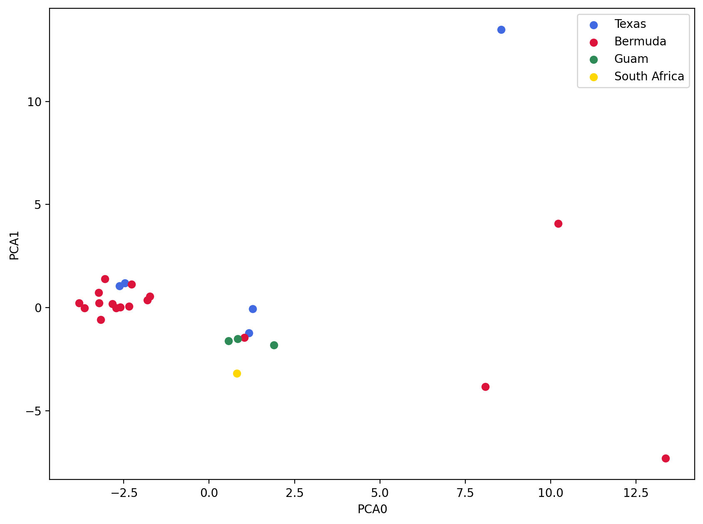
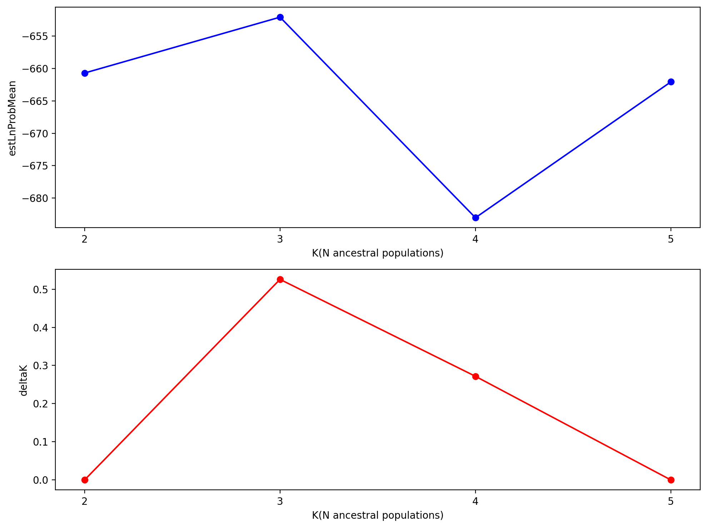
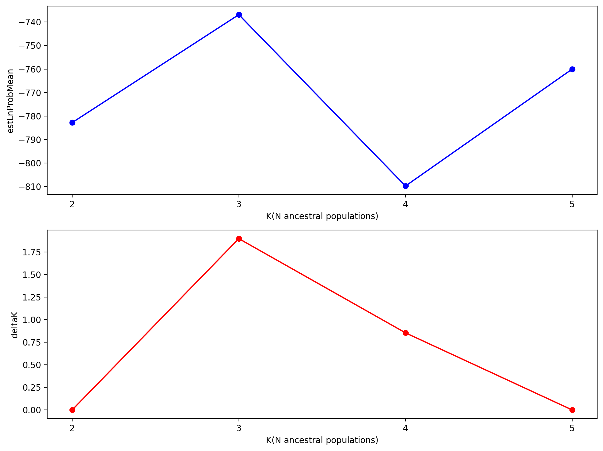
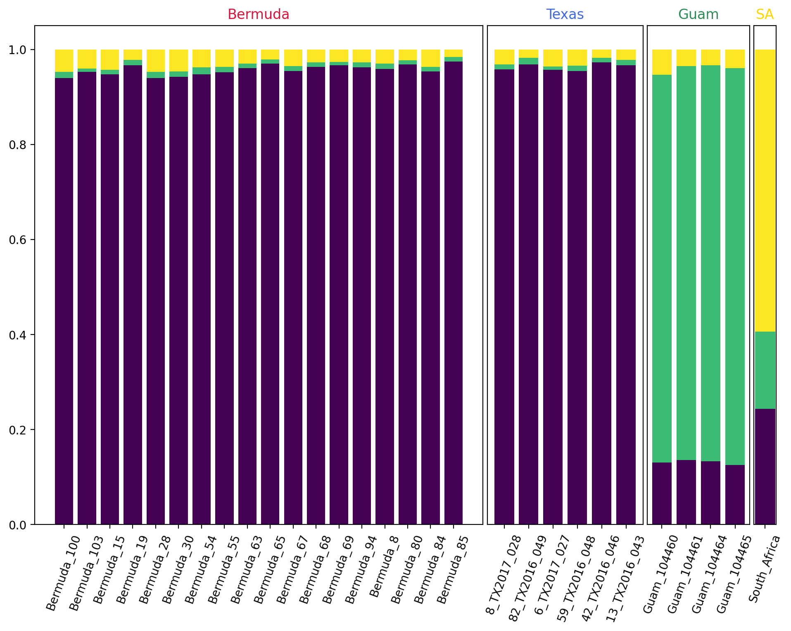

# Masked Assembly

## PCA analysis

    Samples: 29
    Sites before filtering: 101658
    Filtered (indels): 0
    Filtered (bi-allel): 3584
    Filtered (mincov): 154
    Filtered (minmap): 95712
    Filtered (subsample invariant): 8687
    Filtered (minor allele frequency): 0
    Filtered (combined): 96924
    Sites after filtering: 5440
    Sites containing missing values: 5372 (98.75%)
    Missing values in SNP matrix: 30572 (19.38%)
    SNPs (total): 5440
    SNPs (unlinked): 404
    Imputation (null; sets to 0): 100.0%, 0.0%, 0.0%

    Text(0, 0.5, 'PCA1')

    

    

    Text(0, 0.5, 'PCA1')

    

    

## Structure Analysis

    Samples: 29
    Sites before filtering: 101658
    Filtered (indels): 0
    Filtered (bi-allel): 3584
    Filtered (mincov): 100625
    Filtered (minmap): 95712
    Filtered (subsample invariant): 8687
    Filtered (minor allele frequency): 0
    Filtered (combined): 101651
    Sites after filtering: 713
    Sites containing missing values: 645 (90.46%)
    Missing values in SNP matrix: 1024 (4.95%)
    SNPs (total): 713
    SNPs (unlinked): 89

|    |   Nreps |    lnPK |   lnPPK |   deltaK |   estLnProbMean |   estLnProbStdev |
|---:|--------:|--------:|--------:|---------:|----------------:|-----------------:|
|  2 |      20 |   0     |   0     | 0        |        -650.04  |          29.1424 |
|  3 |      20 |  -2.265 |  38.04  | 0.492212 |        -652.305 |          77.2838 |
|  4 |      20 | -40.305 |  57.915 | 0.30837  |        -692.61  |         187.81   |
|  5 |      20 |  17.61  |   0     | 0        |        -675     |          68.5632 |

    

    

    [K4] 20/20 results permuted across replicates (max_var=0).

    

    

# Unmasked Assembly

## PCA analysis

    Samples: 29
    Sites before filtering: 205250
    Filtered (indels): 0
    Filtered (bi-allel): 5653
    Filtered (mincov): 154
    Filtered (minmap): 191734
    Filtered (subsample invariant): 12116
    Filtered (minor allele frequency): 0
    Filtered (combined): 193483
    Sites after filtering: 12518
    Sites containing missing values: 11700 (93.47%)
    Missing values in SNP matrix: 73046 (20.12%)
    SNPs (total): 12518
    SNPs (unlinked): 524
    Imputation (null; sets to 0): 100.0%, 0.0%, 0.0%
    Subsampling SNPs: 524/12518

    Text(0, 0.5, 'PCA1')

    

    

    Text(0, 0.5, 'PCA1')

    

    

## Structure analysis

    Samples: 29
    Sites before filtering: 205250
    Filtered (indels): 0
    Filtered (bi-allel): 5653
    Filtered (mincov): 201692
    Filtered (minmap): 191734
    Filtered (subsample invariant): 12116
    Filtered (minor allele frequency): 0
    Filtered (combined): 203521
    Sites after filtering: 2480
    Sites containing missing values: 1662 (67.02%)
    Missing values in SNP matrix: 2472 (3.44%)
    SNPs (total): 2480
    SNPs (unlinked): 97
    [####################] 100% 0:06:32 | running 80 structure jobs 

|    |   Nreps |   lnPK |   lnPPK |   deltaK |   estLnProbMean |   estLnProbStdev |
|---:|--------:|-------:|--------:|---------:|----------------:|-----------------:|
|  2 |      20 |  0     |   0     | 0        |        -863     |          323.105 |
|  3 |      20 | -0.805 |  70.45  | 0.200537 |        -863.805 |          351.307 |
|  4 |      20 | 69.645 |  31.945 | 0.263295 |        -794.16  |          121.328 |
|  5 |      20 | 37.7   |   0     | 0        |        -756.46  |          103.196 |

    

    

    [K4] 20/20 results permuted across replicates (max_var=0).

    

    

