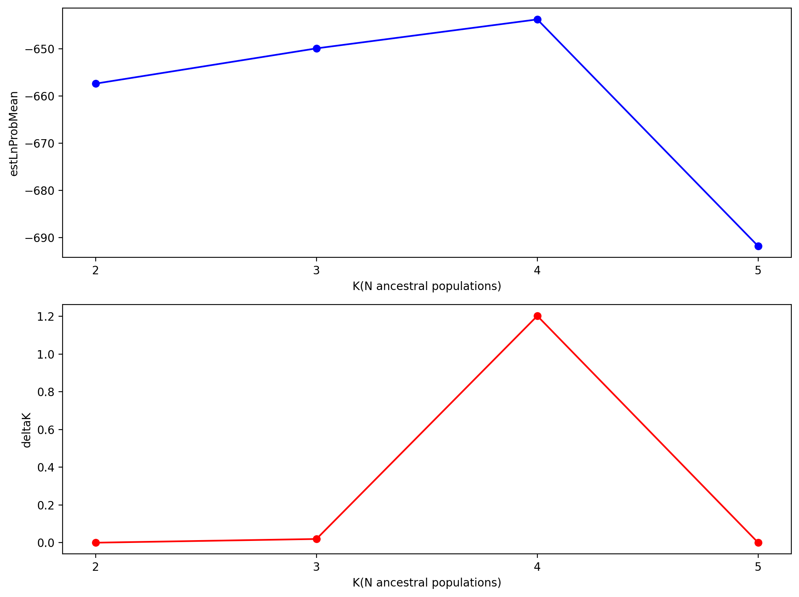
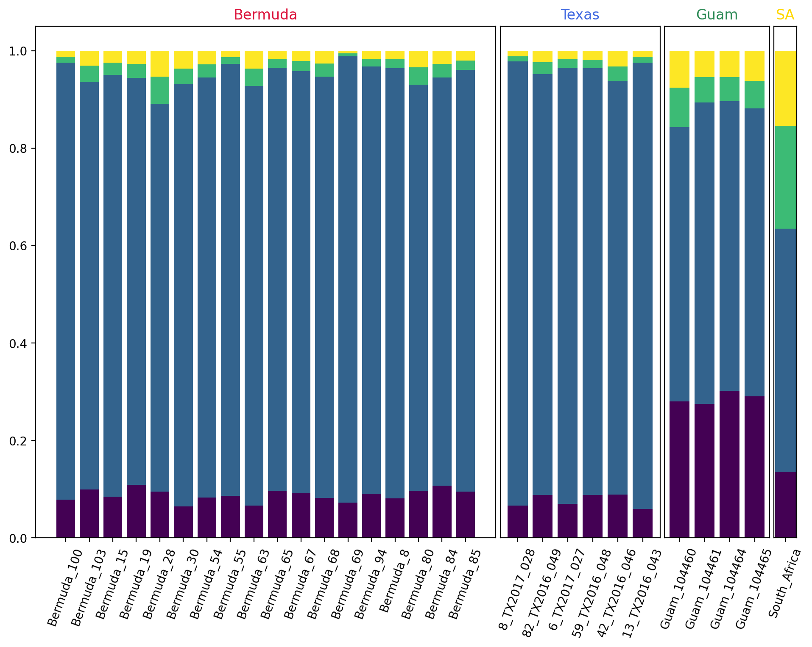

# PCA analysis

    Samples: 29
    Sites before filtering: 101658
    Filtered (indels): 0
    Filtered (bi-allel): 3584
    Filtered (mincov): 154
    Filtered (minmap): 95712
    Filtered (subsample invariant): 8687
    Filtered (minor allele frequency): 0
    Filtered (combined): 96924
    Sites after filtering: 5440
    Sites containing missing values: 5372 (98.75%)
    Missing values in SNP matrix: 30572 (19.38%)
    SNPs (total): 5440
    SNPs (unlinked): 404
    Imputation (null; sets to 0): 100.0%, 0.0%, 0.0%

    Subsampling SNPs: 404/5440

    Text(0, 0.5, 'PCA1')

    

    

    Text(0, 0.5, 'PCA1')

    

    

# Structure Analysis

    78 previous results loaded for run [comp]
    Samples: 29
    Sites before filtering: 101658
    Filtered (indels): 0
    Filtered (bi-allel): 3584
    Filtered (mincov): 100625
    Filtered (minmap): 95712
    Filtered (subsample invariant): 8687
    Filtered (minor allele frequency): 0
    Filtered (combined): 101651
    Sites after filtering: 713
    Sites containing missing values: 645 (90.46%)
    Missing values in SNP matrix: 1024 (4.95%)
    SNPs (total): 713
    SNPs (unlinked): 89

    [####################] 100% 0:03:27 | running 40 structure jobs 

|    |   Nreps |    lnPK |   lnPPK |    deltaK |   estLnProbMean |   estLnProbStdev |
|---:|--------:|--------:|--------:|----------:|----------------:|-----------------:|
|  2 |      25 |   0     |   0     | 0         |        -657.38  |          22.7608 |
|  3 |      25 |   7.476 |   1.332 | 0.0195536 |        -649.904 |          68.1204 |
|  4 |      25 |   6.144 |  54.244 | 1.20246   |        -643.76  |          45.1108 |
|  5 |      25 | -48.1   |   0     | 0         |        -691.86  |         103.156  |

    

    

    [K4] 25/25 results permuted across replicates (max_var=0).

    

    

